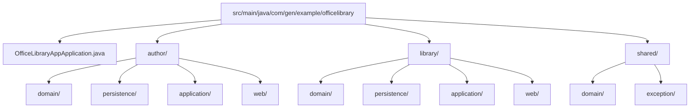
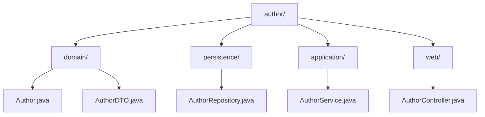
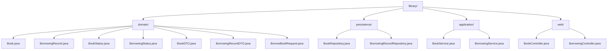
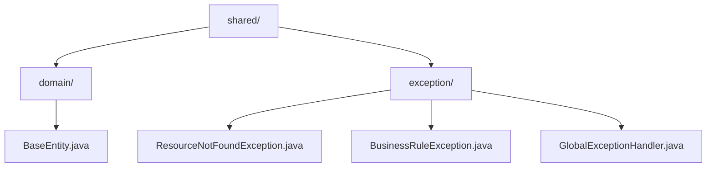
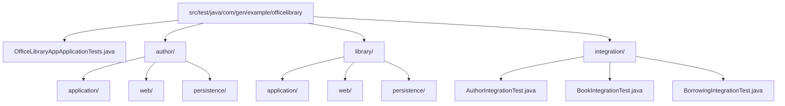
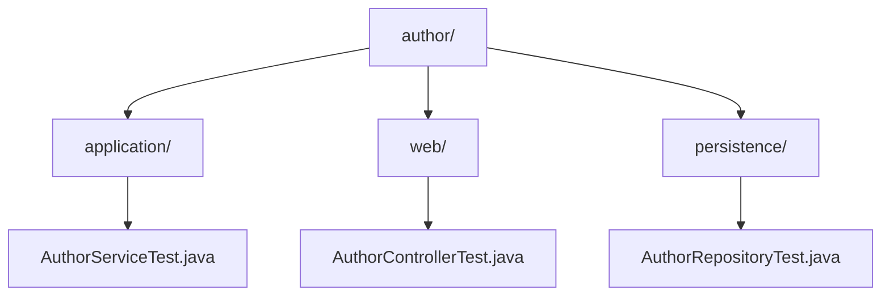
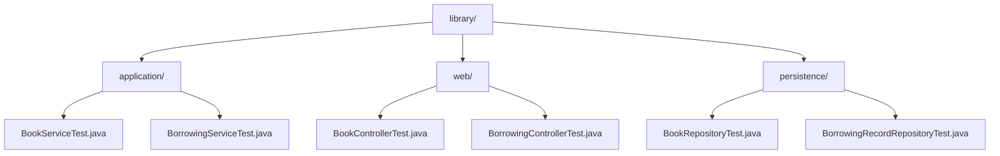

# Office Library App - Architecture Design

## File Structure

### Main Code Structure

### Author Aggregate Structure

### Library Aggregate Structure

### Shared Components Structure

### Test Code Structure

### Author Test Structure

### Library Test Structure

## API Endpoints

### Author Management
- `GET /api/authors` - List all authors with optional filtering
- `GET /api/authors/{id}` - Get specific author details
- `POST /api/authors` - Create new author
- `PUT /api/authors/{id}` - Update author information
- `DELETE /api/authors/{id}` - Delete author (only if no books associated)
- `GET /api/authors/{id}/books` - Get all books by specific author
- `GET /api/authors/search?query={searchTerm}` - Search authors by name

### Book Management
- `GET /api/books` - List all books with optional filtering (status, genre, author)
- `GET /api/books/{id}` - Get specific book details
- `POST /api/books` - Add new book to library
- `PUT /api/books/{id}` - Update book information
- `DELETE /api/books/{id}` - Remove book from library (only if not borrowed)
- `GET /api/books/search?query={searchTerm}` - Search books by title, author, or ISBN
- `GET /api/books/available` - List only available books
- `GET /api/books/{bookId}/borrowing-history` - Get borrowing history for a book

### Borrowing Management
- `GET /api/borrowing-records` - List all borrowing records with optional filtering
- `GET /api/borrowing-records/{id}` - Get specific borrowing record
- `POST /api/books/{bookId}/borrow` - Borrow a book (creates borrowing record)
- `PUT /api/borrowing-records/{id}/return` - Return a borrowed book
- `GET /api/borrowing-records/overdue` - List overdue borrowing records
- `GET /api/borrowing-records/by-borrower?email={email}` - Get borrowing records by borrower

## Architecture Decisions

### Aggregate Design
**Decision**: Separate Author and Library aggregates based on domain boundaries
**Rationale**: 
- Authors can exist independently of books and have different lifecycle management
- Library operations (borrowing/returning) require atomic consistency between Book and BorrowingRecord
- This separation reduces contention and allows for independent scaling

### Package Structure
**Decision**: Use aggregate-based package structure with layered sub-packages
**Rationale**:
- Follows Domain-Driven Design principles
- Clear separation of concerns within each aggregate
- Easy to locate and maintain related functionality
- Supports future microservice extraction if needed

### Entity Design
**Decision**: Use UUID as primary keys for all entities
**Rationale**:
- Provides globally unique identifiers
- Better for distributed systems and data migration
- Avoids sequential ID guessing attacks

### DTO Usage
**Decision**: Create DTOs for external API communication
**Rationale**:
- Separates internal domain model from API contracts
- Allows for API versioning without affecting domain entities
- Provides better control over data exposure
- Enables validation at the API boundary

### Service Layer Design
**Decision**: Separate BookService and BorrowingService within Library aggregate
**Rationale**:
- BookService handles book lifecycle and inventory management
- BorrowingService handles borrowing operations and business rules
- Clear separation of responsibilities while maintaining aggregate consistency

### Repository Design
**Decision**: One repository per entity following Spring Data JPA patterns
**Rationale**:
- Leverages Spring Data JPA's automatic implementation
- Provides type-safe query methods
- Supports custom queries when needed
- Follows established Spring Boot patterns

### Exception Handling
**Decision**: Custom exceptions with global exception handler
**Rationale**:
- Provides consistent error responses across the API
- Separates business logic errors from technical errors
- Enables proper HTTP status code mapping
- Improves API usability and debugging

### Validation Strategy
**Decision**: Bean Validation (JSR-303) annotations on DTOs and entities
**Rationale**:
- Declarative validation approach
- Consistent validation across layers
- Automatic integration with Spring Boot
- Clear documentation of constraints

### Testing Strategy
**Decision**: Unit tests for each layer plus integration tests for critical paths
**Rationale**:
- Unit tests ensure individual component correctness
- Integration tests verify end-to-end functionality
- Repository tests validate custom queries
- Controller tests ensure proper API behavior

### Database Design
**Decision**: JPA entities with appropriate relationships and constraints
**Rationale**:
- Leverages JPA's ORM capabilities
- Maintains referential integrity
- Supports lazy loading for performance
- Enables database-agnostic development

### Business Rules Implementation
**Decision**: Implement business rules in service layer with custom exceptions
**Rationale**:
- Centralizes business logic in appropriate layer
- Provides clear error messages for rule violations
- Enables consistent rule enforcement across all entry points
- Supports future rule modification without API changes