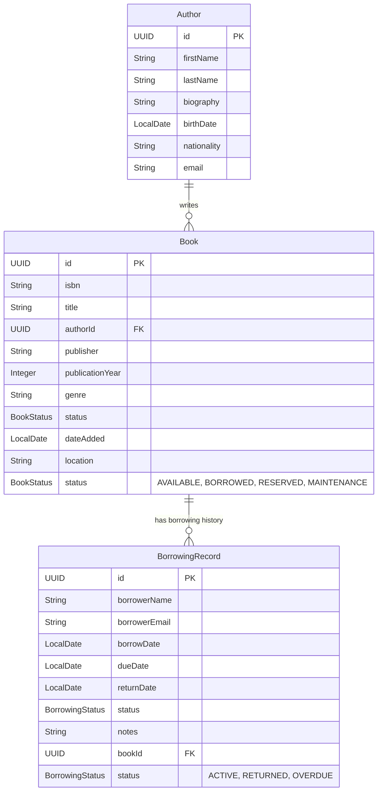

# Office Library Book Tracking System - Requirements

## Domain Model

This document outlines the domain model for a CRUD application to track books in an office library.

## Aggregates and Entities

### Aggregate: Author

The Author aggregate manages author information independently from books, allowing for proper normalization and author management.

#### Entity: Author

**Fields**

- name: id
- type: UUID
- validation: [NotNull]

- name: firstName
- type: String
- validation: [NotNull, Size(min=1, max=100)]

- name: lastName
- type: String
- validation: [NotNull, Size(min=1, max=100)]

- name: biography
- type: String
- validation: [Size(max=1000)]

- name: birthDate
- type: LocalDate
- validation: []

- name: nationality
- type: String
- validation: [Size(max=100)]

- name: email
- type: String
- validation: [Email, Size(max=255)]

**Relationships**

- type: OneToMany, with: Book, field: books

### Aggregate: Library

The Library aggregate represents the core domain for managing books and their circulation within an office library. This aggregate maintains consistency around book inventory and borrowing operations.

#### Entity: Book

**Fields**

- name: id
- type: UUID
- validation: [NotNull]

- name: isbn
- type: String
- validation: [NotNull, Size(min=10, max=17)]

- name: title
- type: String
- validation: [NotNull, Size(min=1, max=255)]

- name: authorId
- type: UUID
- validation: [NotNull]

- name: publisher
- type: String
- validation: [Size(max=255)]

- name: publicationYear
- type: Integer
- validation: [Min(1000), Max(9999)]

- name: genre
- type: String
- validation: [Size(max=100)]

- name: status
- type: BookStatus (enum: AVAILABLE, BORROWED, RESERVED, MAINTENANCE)
- validation: [NotNull]

- name: dateAdded
- type: LocalDate
- validation: [NotNull]

- name: location
- type: String
- validation: [Size(max=100)]

**Relationships**

- type: OneToMany, with: BorrowingRecord, field: borrowingRecords
- type: ManyToOne, with: Author, field: author

#### Entity: BorrowingRecord

**Fields**

- name: id
- type: UUID
- validation: [NotNull]

- name: borrowerName
- type: String
- validation: [NotNull, Size(min=1, max=255)]

- name: borrowerEmail
- type: String
- validation: [NotNull, Email, Size(max=255)]

- name: borrowDate
- type: LocalDate
- validation: [NotNull]

- name: dueDate
- type: LocalDate
- validation: [NotNull]

- name: returnDate
- type: LocalDate
- validation: []

- name: status
- type: BorrowingStatus (enum: ACTIVE, RETURNED, OVERDUE)
- validation: [NotNull]

- name: notes
- type: String
- validation: [Size(max=500)]

**Relationships**

- type: ManyToOne, with: Book, field: book

## Aggregate Design Rationale

### Author Aggregate

**Size Justification:**
- **Transaction Size**: Author information is relatively stable and doesn't require frequent updates
- **Concurrency**: Authors can be managed independently of books, reducing contention
- **Read/Write Patterns**: Author information is primarily read when displaying book details

**Consistency Requirements:**
- Author information should remain consistent across all books by the same author
- Authors can exist without books (for future book additions)

### Library Aggregate

**Size Justification:**
- **Transaction Size**: The aggregate is sized to handle typical library operations (borrowing, returning, updating book status) within a single transaction
- **Concurrency**: Book and BorrowingRecord are tightly coupled - when a book is borrowed, both entities must be updated atomically
- **Read/Write Patterns**: Most operations involve reading book information along with its current borrowing status, making this a natural aggregate boundary

**Consistency Requirements:**
- When a book is borrowed, its status must change to BORROWED and a new BorrowingRecord must be created
- When a book is returned, the BorrowingRecord must be updated and the book status changed to AVAILABLE
- These operations must be atomic to maintain data consistency

## Functionality and Endpoints

### Core CRUD Operations

#### Author Management
- **GET /api/authors** - List all authors with optional filtering
- **GET /api/authors/{id}** - Get specific author details
- **POST /api/authors** - Add new author
- **PUT /api/authors/{id}** - Update author information
- **DELETE /api/authors/{id}** - Remove author (only if no books associated)
- **GET /api/authors/{id}/books** - Get all books by specific author

#### Book Management
- **GET /api/books** - List all books with optional filtering (status, genre, author)
- **GET /api/books/{id}** - Get specific book details
- **POST /api/books** - Add new book to library
- **PUT /api/books/{id}** - Update book information
- **DELETE /api/books/{id}** - Remove book from library (only if not borrowed)

#### Borrowing Management
- **GET /api/borrowing-records** - List all borrowing records with optional filtering
- **GET /api/borrowing-records/{id}** - Get specific borrowing record
- **POST /api/books/{bookId}/borrow** - Borrow a book (creates borrowing record)
- **PUT /api/borrowing-records/{id}/return** - Return a borrowed book
- **GET /api/books/{bookId}/borrowing-history** - Get borrowing history for a book

#### Search and Query Operations
- **GET /api/books/search?query={searchTerm}** - Search books by title, author, or ISBN
- **GET /api/books/available** - List only available books
- **GET /api/borrowing-records/overdue** - List overdue borrowing records
- **GET /api/borrowing-records/by-borrower?email={email}** - Get borrowing records by borrower
- **GET /api/authors/search?query={searchTerm}** - Search authors by name

## Domain Model Diagram

## Business Rules

1. **Book Availability**: A book can only be borrowed if its status is AVAILABLE
2. **Single Active Borrowing**: A book can have only one active borrowing record at a time
3. **Due Date Calculation**: Due date is automatically set to 14 days from borrow date
4. **Overdue Detection**: System should identify overdue books (current date > due date and status = ACTIVE)
5. **Email Validation**: Borrower email must be valid and unique per active borrowing
6. **ISBN Uniqueness**: Each book must have a unique ISBN in the system
7. **Deletion Constraints**: Books with active borrowing records cannot be deleted
8. **Author Constraints**: Authors with associated books cannot be deleted
9. **Author-Book Relationship**: Each book must have a valid author reference

## Validation Rules

- **ISBN**: Must be valid ISBN-10 or ISBN-13 format
- **Publication Year**: Must be between 1000 and current year + 1
- **Email**: Must be valid email format
- **Dates**: Borrow date cannot be in the future, due date must be after borrow date
- **Required Fields**: All NotNull fields must be provided
- **String Lengths**: All string fields have maximum length constraints to prevent database issues